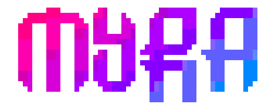

# MYRA


### Description
My Recon Automation (MYRA) is a script to perform initial lighweight recon on a target.
It will look for target domains in ~/hunt/\<org_name>/domains.txt.
Output will be in the Output folder in myra directory.

### What it does


### Usage
1. Create a directory `hunt` in the home folder.
`mkdir ~/hunt`
2. Create organisation directory. Eg: twitter.
3. Put root domains in domains.txt in organisation directory. Eg: `~/hunt/twitter/domains.txt`

### Installation
```bash
git clone https://github.com/ritikx01/myra.git
cd myra
chmod +x myra.sh install.sh
./install.sh
```

### Tools used

- [PureDNS](https://github.com/d3mondev/puredns)
- [DNS Validator](https://github.com/vortexau/dnsvalidator)
- [Amass](https://github.com/OWASP/Amass)
- [httpx](https://github.com/projectdiscovery/httpx)
- [gospider](https://github.com/jaeles-project/gospider)

